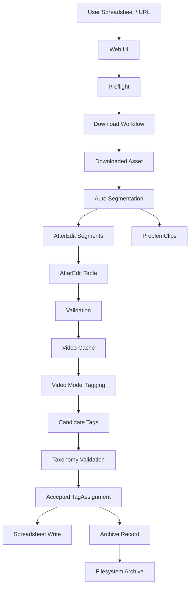

# 04_STATE_AND_DATA.md

## Status

- Project Name: `LabourCompressor`
- Product Version: `v0.5`
- Data Strategy: `SSOT-driven`
- Sync Strategy: `Hybrid`
- Push Channel: `Task State / Workflow State`
- Pull Channel: `Query Data / Search Data / Read Models`
- Primary Goal: `State Discipline`

---

## Mission

本文件定义系统真相来源、核心实体、状态分区、数据流和一致性规则，防止任务状态、文件索引、标签版本、凭证配置、调用报告和 UI 状态混杂。

V0.5 数据模型必须支撑 Web UI 自动分割流程：下载后把长视频拆为 `3-30s` 片段，合法片段进入 `AfterEdit`，问题片段进入 `ProblemClips`。

---

## Data Semantics

自动化数据分四层：

- `Raw Input`: URL、本地媒体、标签库 Markdown、用户表格行、平台凭证配置引用
- `Candidate`: 模型候选标签、下载候选格式、迁移候选映射
- `Accepted Record`: 被规则接受的正式标签、归档、索引、报告记录
- `Execution Output`: 文件系统、表格、数据库、导出包中的副作用结果

强制规则：

- `Candidate` 不是事实。
- `Accepted Record` 才允许进入索引、回表、报告和归档。
- `Execution Output` 只能由 `Accepted Record` 驱动。
- 凭证值本身不得进入业务记录、日志、报告或测试输出。

---

## V0.5 Workflow State

V0.5 标准状态流：

```text
created
-> preflight_checked
-> downloading
-> downloaded
-> auto_segmenting
-> auto_segmented
-> after_edit_validated
-> video_cache_created
-> video_tagged
-> tags_accepted
-> spreadsheet_written
-> archived
-> completed
```

失败状态必须记录：

- `failedStage`
- `failureType`
- `failureMessage`
- `nextAction`
- `sourceRow`
- `url` 或 `fileName`

下载后不得直接进入 `video_cache_created`；自动分割开启时必须先经过 `auto_segmenting` 与 `auto_segmented`。V0.2 人工 `AfterEdit` 状态作为兼容路径保留。

---

## Single Source of Truth

Canonical SSOT：

- `SQLite`: 任务状态、下载与归档索引、标签版本元数据、决策指纹、候选摘要、标签赋值记录、调用报告识别码。
- `Filesystem`: 原始媒体、下载缓存、`AfterEdit` 剪辑后文件、压缩缓存、归档后媒体、报告导出文件。
- `Taxonomy Markdown`: 标签树原文和版本差异计算输入。
- `xlsx` 总表: 面向用户的完整结果承载表，不替代运行态数据库。

Explicit Non-SSOT：

- UI 内存状态
- Agent 临时上下文
- 模型原始回答文本
- 浏览器缓存
- 真实 API key 或 cookies 内容
- 临时下载路径

---

## Core Entities

核心实体：

- `Task`
- `SourceUrl`
- `PlatformCredentialRef`
- `MediaAsset`
- `SegmentRecord`
- `ProblemClipRecord`
- `AfterEditAsset`
- `VideoCacheAsset`
- `TaxonomyVersion`
- `TagCandidateSet`
- `TagAssignment`
- `ArchiveRecord`
- `SpreadsheetWriteRecord`
- `DecisionFingerprint`

实体规则：

- `PlatformCredentialRef` 只保存凭证引用、平台、来源类型和校验状态，不保存真实 cookies 或 key 内容。
- `AfterEditAsset` 是第二阶段输入，不等同于原下载文件。
- `SegmentRecord` 表示通过 `3-30s` 时长治理的可打标片段。
- `ProblemClipRecord` 只允许三类问题：`无法满足 3-30s`、`导出失败`、`检测结果异常`。
- `VideoCacheAsset` 记录压缩 profile、源文件哈希、缓存路径和大小。
- `TagAssignment` 必须绑定 `TaxonomyVersion` 与 `DecisionFingerprint`。
- `ArchiveRecord` 只能绑定唯一 `内容题材` 路径。

---

## Data Flow



---

## State Partitioning

### Server State

可从持久层重建的状态：

- 任务记录
- 行级进度
- 下载状态
- `AfterEdit` 表生成状态
- 视频缓存状态
- 打标、回表、归档状态
- 失败类型与重试建议
- 标签版本与决策指纹

### Global UI State

跨页面共享但可由 Server State 或配置重建：

- 当前任务 ID
- 当前用户表路径
- 当前归档根目录
- 当前模型 profile
- 当前平台凭证配置状态
- 当前 Preflight 结果

### Local UI State

仅用于交互，不持久化为事实：

- 折叠面板状态
- 当前 tab
- 筛选条件
- 临时输入框内容
- 拖拽 hover 状态

---

## Credential Data Policy

允许持久化：

- provider 名称
- model profile
- 平台名称
- 凭证引用路径
- `cookies-from-browser` 的浏览器名称和 profile 标识
- 校验时间
- 校验状态
- 失败分类

禁止持久化或输出：

- API key 明文
- cookies 文件内容
- token / secret
- 浏览器 cookies 原始值
- 可复用的认证头

Preflight 可检查凭证是否存在、可读、可用于当前平台，但错误信息只能给出用户可理解分类，不得回显敏感内容。

---

## Video Tagging Data Policy

正式打标输入必须是视频文件或其标准压缩缓存。

`VideoCacheAsset` 必须记录：

- `sourceAssetId`
- `sourceHash`
- `cachePath`
- `profile`
- `widthPolicy`
- `frameRatePolicy`
- `videoCodec`
- `videoBitrate`
- `audioCodec`
- `audioBitrate`
- `container`
- `sizeBytes`

当前 profile 固定为：

```text
360p + 原帧率保持 + H.264 650 kbps + AAC 64 kbps + mp4 + 源文件哈希复用
```

抽帧结果不得作为默认正式输入。若显式降级，必须记录 `degradationReason` 和 `degradationMode`。

---

## Spreadsheet Data Policy

用户表支持：

- `xlsx`
- `csv`
- `numbers`

正式完整能力标准为 `xlsx`。

程序内总表固定为 `xlsx`，写回目标固定为 `both`：用户表与程序内总表同时回填。

标准列：

- `URL` 或 `文件名`
- `采集人`
- `归档状态`
- `一级标签`
- `二级标签`
- `三级标签`
- `四级标签`
- `归档路径`
- `归档文件名`
- `失败信息`

`归档文件名` 在 `xlsx` 中应可作为本地文件链接。

---

## Tagging and Archive Semantics

结构化标签规则：

- 模型输出只能生成 `TagCandidateSet`。
- taxonomy 合法化后才能生成 `TagAssignment`。
- 回表必须保留多分支正式标签。
- 同一级多标签使用固定分隔符写入同一单元格。
- 回填内容必须带 0 级标签前缀，避免分支归属丢失。

归档规则：

- 归档层只消费 `内容题材`。
- 每个视频只能保留唯一一条 `内容题材` 路径用于归档。
- 非 `内容题材` 分支不得参与目录生成。
- 归档根目录固定为 `视频数据归档库/内容题材`。

---

## Cache Rules

可缓存：

- taxonomy 解析结果
- prompt library 解析结果
- 视频压缩缓存
- 只读查询视图
- Preflight 最近一次结果摘要

不可缓存为事实：

- 模型原始回答
- 真实凭证值
- UI 临时输入
- 未接受候选标签

缓存失效：

- taxonomy 文件变化
- prompt library 变化
- 源视频哈希变化
- provider 或 model profile 变化
- 平台凭证配置变化

---

## Memory Compression Consistency Plan

Agent 或 UI 的压缩上下文不得成为事实来源。

压缩摘要必须保留：

- 当前任务 ID
- 当前阶段
- 已完成 checkpoint
- 待处理文件集合
- 失败项集合
- taxonomy version
- model profile
- video cache profile
- `AfterEdit` 表路径

恢复算法：

1. 从 SQLite 读取任务和 checkpoint。
2. 从文件系统校验媒体、`AfterEdit`、缓存和归档产物。
3. 从表格读取行级状态。
4. 比对三方状态。
5. 冲突时以持久化任务状态和文件实际存在性为准，UI 摘要只作提示。

---

## Integrity Constraints

- 任务状态推进必须单调，除显式 retry 外不得倒退。
- 关键副作用前必须写 checkpoint。
- 下载后必须暂停等待人工剪辑。
- 第二阶段必须从 `AfterEdit` 表和文件夹校验结果启动。
- 视频打标默认不得抽帧。
- 凭证明文不得进入记录、日志、报告或测试输出。
- 归档记录必须能追溯到标签版本、模型、视频缓存 profile 和源文件。
- 单文件超过 500 行时必须先优化结构，再考虑拆分。

---

## Final Position

V0.5 的数据纪律是：凭证只存引用，候选不当事实，自动分割后的合法片段才进入正式打标链路，问题片段必须挂起标记，唯一 `内容题材` 才驱动归档，所有关键结果都可追溯。
